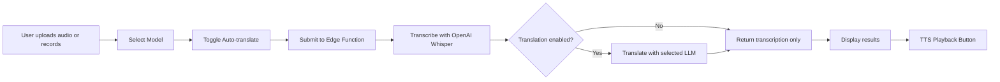

# Voice Transcriber Simplification Plan

## Overview
Transform the current analysis-heavy voice transcription app into a simple, focused tool for:
1. Speech-to-Text transcription
2. Optional Afrikaans → English (or any language) translation
3. Model selection (OpenAI/OpenRouter)
4. Text-to-Speech playback

## Current State
- Complex analysis features: summary, intent, sentiment, key points
- Fixed OpenAI/ElevenLabs flow
- Heavy UI with multiple result sections

## Target State
- Clean transcription output
- Optional translation toggle
- Model selector dropdown
- Simple TTS playback button
- Streamlined UI

## Architecture Flow



## Data Model Changes

### Before
```typescript
{
  transcription: string;
  translation?: string;
  detectedLanguage: string;
  summary: string;
  intent: string;
  keyPoints: string[];
  sentiment: string;
}
```

### After
```typescript
{
  transcription: string;
  translation: string | null;
  detectedLanguage: string;
}
```

## Implementation Steps

###  1. Backend (Edge Function)
- [x] Remove AI analysis logic
- [x] Keep transcription (OpenAI Whisper primary, ElevenLabs fallback)
- [x] Add optional translation with model selection
- [ ] Deploy updated function

### 2. Frontend Types
- [ ] Update TranscriptionResult interface
- [ ] Remove unused analysis imports

### 3. UI Components
- [ ] Simplify ResultsDisplay to show transcription + optional translation
- [ ] Add model selector (dropdown with OpenAI and OpenRouter models)
- [ ] Add auto-translate checkbox
- [ ] Add TTS button using Web Speech API
- [ ] Update branding/copy

### 4. Integration
- [ ] Pass `model` and `translate` params to Edge Function
- [ ] Handle new simplified response format
- [ ] Test with different models

## Model Options

### OpenAI Models
- gpt-4o
- gpt-4o-mini (default)
- gpt-4-turbo

###  OpenRouter Models  
- openai/gpt-4o
- openai/gpt-4o-mini (default)
- anthropic/claude-3.5-sonnet
- google/gemini-pro

## Text-to-Speech Implementation
Use browser's Web Speech API:
```javascript
const utterance = new SpeechSynthesisUtterance(text);
utterance.lang = 'en-US'; // or detected language
window.speechSynthesis.speak(utterance);
```

## Success Criteria
- User can transcribe audio in under 3 seconds
- Translation works for Afrikaans → English
- Model selection affects translation quality
- TTS reads back results clearly
- UI is clean and intuitive
